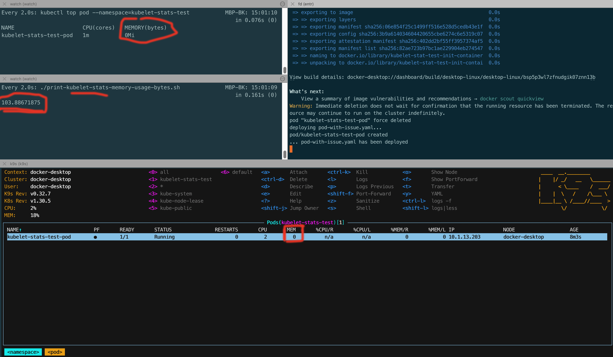

Recommended setup:

1. Make sure the metrics-server is installed, for example:
    - `helm repo add metrics-server https://kubernetes-sigs.github.io/metrics-server/`
    - `helm repo update`
    - `helm upgrade --install --set args={--kubelet-insecure-tls} metrics-server metrics-server/metrics-server --namespace kube-system`
2. Run `./redeploy-pod.sh pod-with-issue.yaml`.
3. In a separate shell, start `watch kubectl top pod --namespace=kubelet-stats-test` and let it run.
4. In a separate shell, start `watch ./print-kubelet-stats-memory-usage-bytes.sh` and let it run.
   This prints the value that kubelet stats report (that is,
   `kubectl get --raw /api/v1/nodes/docker-desktop/proxy/stats/summary` -> pod -> `.memory.usageBytes` formatted in MB).
   Note: If your node name is not `docker-desktop`, you might need to edit this file.
5. Optional: In a separate shell, start `k9s`, open the namespace `kubelet-stats-test` and lists its pods to observer
   the memory values it reports. (Might use `kubectl top pod` or something similar under the hood, not sure.)

Observations:
- The memory usage of the pod as reported by `kubectl top` and `k9s` will be at 0 or close to zero.
- The memory.usageBytes reported by kubelet stats (`/api/v1/nodes/docker-desktop/proxy/stats/summary`) will be around
  100 MB.

All three values represent the memory usage of the pod, but the reported value from kubelet stats is different.

